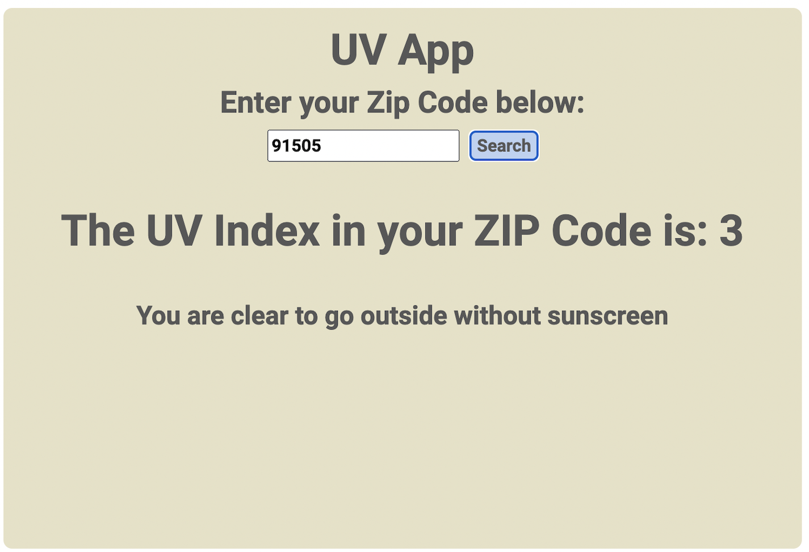

# UV Index App

## This app uses API provided by the US EPA to check the UV index at the current time by the ZIP Code
### Will only work for USA ZIP codes. 
### Made with React

#### How to run: 
- clone this repository / download it to your computer
- the app is running on React CDN so no need to instal node modules!
- if you don't have http-server installed open the command line
- npm install -- global hhtp-server
- cd into the folder with this project 
- http-server -c-1
- navigate to http://localhost:8080/ in your browser
- enter a valid 5-digit Zip code 
- click submit

### Future Improvements
- Fix the bug so that a new valid search resets the error message, if there is one, without refreshing the app
- Improve style 

MIT License 
